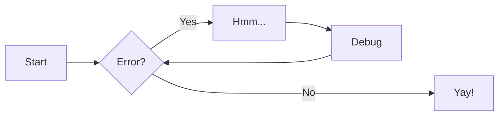

# Diagrams

## Mermaid Diagram

```mermaid
graph LR
  A[Start] --> B{Error?};
  B -->|Yes| C[Hmm...];
  C --> D[Debug];
  D --> B;
  B ---->|No| E[Yay!];
```

## PlantUML Diagram

```plantuml
Bob -> Alice : hello
```
